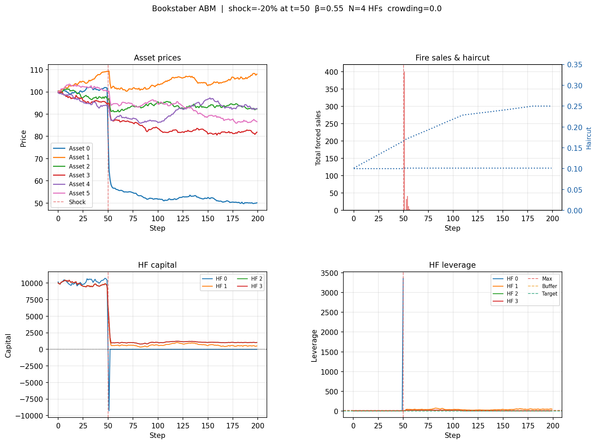
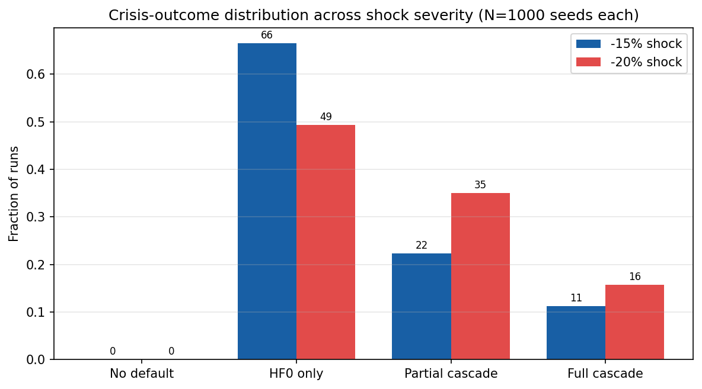
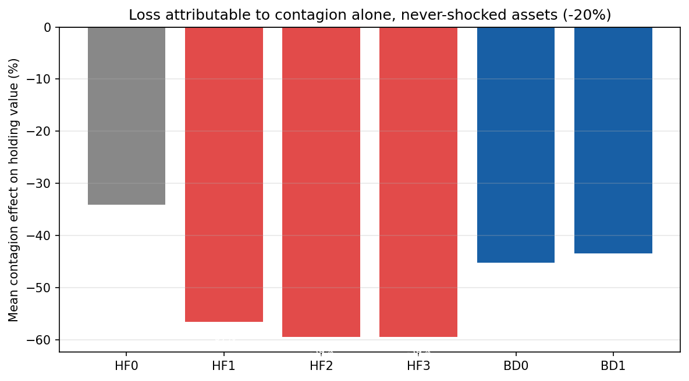
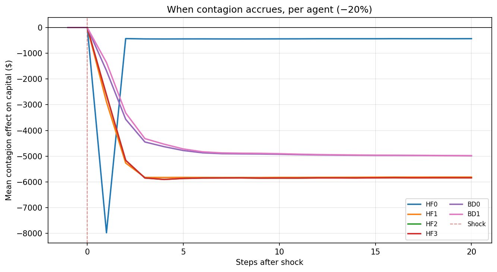
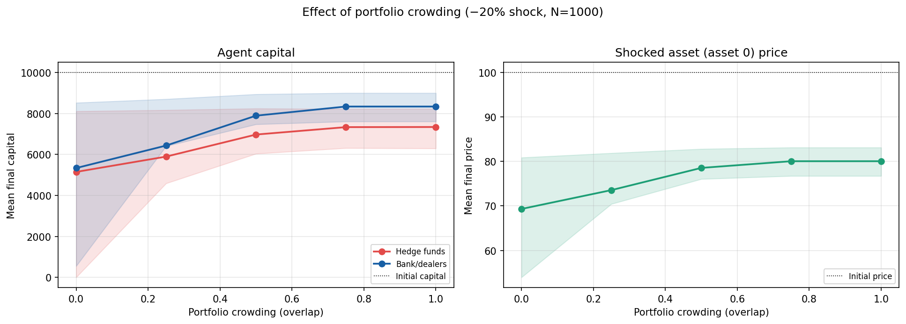
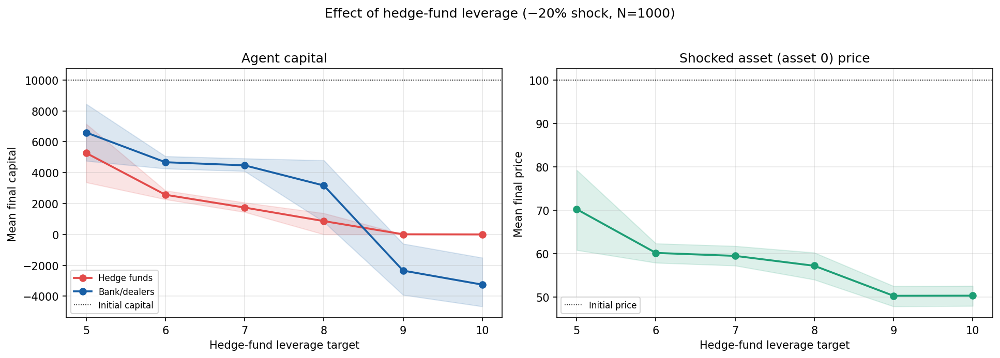

# An Agent-Based Model of Fire Sales and Funding Runs

### Exploring feedback-driven systemic risk as a complement to balance-sheet stress testing

---

## Abstract

This project builds an agent-based model (ABM) of the financial system in order to study
how losses propagate among financial actors in a market. The model involves four classes of
agents: cash providers who supply funding, bank/dealers who intermediate and transform that
funding, hedge funds who use it to lever into asset markets, and a market whose prices move
in response to forced selling. An exogenous price shock to a single asset is injected, and
the system is allowed to react: leverage constraints bind, fire sales fire, prices fall
further, collateral erodes, funding is withdrawn, and defaults cascade.

The central empirical finding is that the extent of a crisis is governed by the system's
reaction to the initial loss, not by the loss itself. Crisis outcomes across 1000 stochastic runs per shock show that the system lands in a small number of qualitatively distinct end-states, and a 5-point change in shock severity
moves probability mass sharply between them. A global sensitivity analysis (1,500
parameter combinations, with all pairwise interactions) shows the cascade is steered by the
parameters that govern how agents react.
TA seed-matched counterfactual that switches off the endogenous reaction while
holding the primary shock fixed shows that the great majority of capital destruction, and almost
every default, is attributable to contagion rather than to direct exposure: at a −15% shock
no firm fails from the direct hit at all, and holdings in assets that were never shocked lose
roughly 40–60% of their value to the cascade alone. Tracking the cascade step by step shows it
propagates outward in time, starting from the highly exposed canary fund, exposed peers next, intermediaries last.

The model is offered as a learning artifact and a demonstration of why dynamic,
feedback-aware tools are a useful complement to the static, single-institution stress tests
that dominate regulatory practice.

---

## 1. Introduction

Most stress testing in practice like the supervisory CCAR/DFAST exercises, and the internal
capital-adequacy frameworks built around them is, essentially a balance-sheet
calculation. A macroeconomic scenario is specified, each institution's losses under that
scenario are projected, and the question is whether each institution's capital survives.
These exercises are indispensable, but they share a structural blind spot: they evaluate
institutions largely one at a time, against an exogenous path, and they do not let one
institution's defensive reaction become another institution's shock. The most damaging
episodes of the 2007–2009 crisis, however, were precisely those second-round effects. Fire
sales depressed the price of assets everyone held, and funding runs withdrew
liquidity from firms that were still, on paper, solvent.

Agent-based modeling offers a way to put those feedback loops at the center of the analysis.
Rather than projecting a fixed loss path, an ABM specifies the rules each agent follows: 
when to deleverage, how much collateral to demand, when to cut a credit line. Then it lets
the aggregate dynamics emerge from their interaction. The price impact of one fund's forced
sale is the input to the next fund's leverage check. This makes the model
a natural laboratory for the question that static tests cannot easily pose. For example, given an
initial loss, how much of the eventual damage is the loss, and how much is the reaction to
it?*

The model in this project is inspired by the financial-system ABM of Bookstaber, Paddrik,
and Tivnan, which maps the funding chain from cash providers through bank/dealers to leveraged
traders.[^bpt] The goals here are to learn how to build such a model end to end, and to use it to explore feedback-driven risk diagnostics that go beyond a conventional stress test. All results that follow are reported as independent output
of this implementation.

Section 2 describes the model, including the
agents, the funding chain, the leverage and fire-sale rules, the price-impact mechanism, and
the period-by-period event loop. Section 3 lays out the experimental design and the three
experiments. Section 4 presents the results: a narrated single crisis, the distribution of
outcomes across shock severity, the global sensitivity ranking, and the primary-versus-
contagion decomposition. Sections 5 and 6 discuss what the model reveals and where it is
limited. Section 7 concludes.

[^bpt]: R. Bookstaber, M. Paddrik, and B. Tivnan, *An Agent-based Model for Financial
Vulnerability* (Office of Financial Research). The present implementation is an independent
re-build inspired by that work; it is not a replication study and is not benchmarked against
that paper's numbers.

---

## 2. The Model

The model is a discrete-time simulation. At each step every agent observes prices, computes
the orders it would like to place, and only then does the system apply all orders and update
state. This means no agent gets to react to another
agent's trade within the same step. They all see the same prices, which keeps the dynamics
free of arbitrary ordering artifacts.

### 2.1 Agents and balance sheets

**Hedge funds (HF).** Leverage-constrained, long-only investors. Each HF holds a portfolio
of assets and rebalances toward a target leverage. Its balance sheet at each step is

$$A_n(t) = \sum_m P_m(t)\, Q_{n,m}(t), \qquad
\text{Lev}_n(t) = \frac{A_n(t)}{\text{Cap}_n(t)}, \qquad
F_n(t) = A_n(t) - \text{Cap}_n(t),$$

where $A_n$ is total assets, $\text{Cap}_n$ is capital (equity), $\text{Lev}_n$ is leverage,
and $F_n$ is the funding it must borrow. Hedge funds are the model's risk-takers and its
canaries.

**Bank/dealers (BD).** Prime brokers that sit in the middle of the funding chain. Each BD is
a composite of four desks:

- a **finance desk** that raises funding from cash providers and manages the BD's own
  creditworthiness;
- a **prime-broker desk** that re-lends funding to hedge funds and holds their collateral;
- a **trading desk** that runs the BD's own leveraged book (mechanically like an HF); and
- a **derivatives desk** that carries bilateral counterparty exposures (disabled in the
  shipped configuration; see §6).

**Cash providers (CP).** The ultimate source of funding (money-market-like lenders). They
size loans against collateral, apply haircuts, and tighten both when a borrower's
creditworthiness deteriorates.

**Asset market.** A single price-formation module that maps net forced order flow into
price changes. Routine rebalancing does not move prices; only forced (fire-sale) flow does.

### 2.2 The funding chain

Funding flows in a chain and collateral flows back up it:

$$\text{Cash provider} \;\rightarrow\; \text{BD finance desk} \;\rightarrow\;
\text{BD prime broker} \;\rightarrow\; \text{Hedge fund.}$$

A cash provider sizes its loan to a bank/dealer as

$$L^{\text{target}}_k = \text{Collateral}_k \,(1 - HC_k), \qquad
L^{\max}_k = \overline{L}\cdot \frac{CW_k}{100}, \qquad
L_k = \min\!\big(L^{\max}_k,\, L^{\text{target}}_k\big),$$

where $HC_k$ is the haircut, $\overline{L}$ is an absolute cap, and $CW_k\in[0,100]$ is the
borrower's creditworthiness. The second term is the key macroprudential lever. A deteriorating
credit rating throttles how much funding the borrower can raise, independent of how much
collateral it can post. The bank/dealer then prioritizes its own trading desk and passes the
remainder through to the hedge funds it finances. When an HF receives less funding than its
portfolio needs, it is squeezed and must sell.

### 2.3 Leverage hierarchy and forced sales

Every leveraged agent obeys a three-level hierarchy,

$$\text{Lev}^{\text{target}} < \text{Lev}^{\text{buffer}} < \text{Lev}^{\max}.$$

In calm conditions the agent rebalances gently toward $\text{Lev}^{\text{target}}$. When
leverage breaches $\text{Lev}^{\max}$ because a price drop shrank capital faster than
assets, the agent is forced to sell, deleveraging back down to $\text{Lev}^{\text{buffer}}$.
Forced sales are the contagion channel. They are tracked separately from routine rebalancing
because only they hit the price-impact equation.

Some refinements make the cascade more realistic:

- **Rate limiting.** An agent can force-sell at most a fraction $\text{max\_liq\_frac}$ of its
  holdings per step. A large deleveraging therefore plays out over several steps rather than as
  a single instantaneous block. This applies on the default-liquidation path too: a defaulted
  fund's book is wound down gradually, not dumped at once.
- **Two-phase fire sale.** Forced selling first concentrates on the shocked asset (the asset
  whose price already fell); once that holding is exhausted, selling falls back to
  proportional-by-holdings across the rest of the book. A blend parameter,
  $\text{fire\_sale\_shock\_concentration}\in[0,1]$, interpolates between pure
  shock-asset-first and pure proportional selling.

### 2.4 Price impact

The market generalizes the standard linear impact rule to allow impact that
grows with trade size. For asset $m$ with net forced flow $f_m$,

$$\beta^{\text{eff}}_m = \beta_0 + \beta_1\,|f_m|, \qquad
PR_m(t) = \beta^{\text{eff}}_m\, f_m + \varepsilon_m, \qquad
P_m(t+1) = \max\!\big(0,\; P_m(t)\,[1 + PR_m(t)]\big),$$

with $\varepsilon_m \sim \mathcal N(0, \sigma^2)$ idiosyncratic price noise. Setting
$\beta_1 = 0$ recovers strict linear impact; $\beta_1 > 0$ makes impact convex in flow.
A doubled fire sale moves the price more than twice as far. Flow is normalized by shares
outstanding, so $\beta_0$ has the clean interpretation "price return per unit fraction of the
float sold." Critically, impact is applied once per step on the aggregated net flow, not
once per agent, so a coordinated rush for the exits is what drives the price, exactly as
intended.

### 2.5 Creditworthiness and the treasury desk

Each bank/dealer runs a treasury desk that ties its funding capacity to its liquidity
position. It carves a fresh liquidity reserve from capital each step, debits it for any
funding shortfall, and computes a liquidity ratio:

$$\text{LiqReserve}_k = r\cdot \text{Cap}_k, \qquad
\text{LiqRatio}_k = \frac{\text{LiqReserve}_k^{\text{residual}}}{\text{FTD}_k},$$

where $\text{FTD}_k$ is funding received from cash providers. When the liquidity ratio falls
below a floor $\text{LiqRatioMin}$, two things tighten:

$$CW_k = \max\!\big(0,\; 100 - \varphi^{CW}\,\max(0,\,\text{LiqRatioMin} - \text{LiqRatio}_k)\big),$$
$$HC_k(t) = \min\!\big(HC^{\text{stressed}},\; HC_k(t-1) + \varphi^{HC}\,\max(0,\,\text{LiqRatioMin} - \text{LiqRatio}_k)\big).$$

Creditworthiness $CW_k$ is stateless. It rebuilds to 100 the moment liquidity recovers
and it gates the loan cap (§2.2). The haircut $HC_k$ only rises and stays
risen for the run. A bank/dealer that exhausts its liquidity reserve (its debit exceeds its
fresh reserve) suffers a liquidity default even if it is still solvent on a mark-to-market
basis. This is the model's funding-run mechanism.

### 2.6 The periodic event loop

Each step executes twelve sub-steps in a fixed order:

1. apply the exogenous shock to prices (only at the shock step);
2. compute net forced flow from the previous period's queued liquidations;
3. update prices via the impact model;
4. mark all portfolios to market (recompute assets, leverage);
5. every agent computes its orders simultaneously (pure, no mutation);
6. aggregate net forced flow for the next price update;
7. update bank/dealer collateral values;
8. cash providers size loans and set haircuts per bank/dealer;
9. distribute funding down the chain (CP → finance → prime broker → HF);
10. apply all orders and update state;
11. check for defaults; queue defaulted agents' liquidations for the next step;
12. record a snapshot.

### 2.7 Default lifecycle and the outcome taxonomy

A hedge fund or bank/dealer that ends a step with capital $\le 0$ is marked inactive.
Default is permanent: an inactive agent computes no further orders, and its holdings are wound
down (rate-limited) as fire-sale flow over subsequent steps. Bank/dealers can also default via
the liquidity-run channel of §2.5.

To classify the system-level outcome of a run, each simulation is sorted into one of four
buckets:

- **No default** : no agent failed;
- **HF0 only** : only the most-exposed hedge fund (the "canary," HF0) failed, with *no other
  agent even entering a fire sale*;
- **Partial cascade** : some, but not all, agents failed;
- **Full cascade** : every hedge fund and every bank/dealer failed.


---

## 3. Experimental Design

### 3.1 Configuration

The shipped configuration has 4 hedge funds, 6 assets, and 2 bank/dealers funded by a
single cash provider, run for 200 steps with the shock injected at step 50. The hedge funds
differ in how concentrated they are in the shocked asset (asset 0): HF0 holds 60% of its book
there and is the canary. HF1–HF3 hold 18–20% and are progressively more diversified. The two
bank/dealers carry a mild (±2 percentage-point) asymmetry in their shock-asset exposure so
that they do not fail in lockstep. Funding is diversified so that HF0 is financed by one
bank/dealer and HF1–HF3 by the other, which separates the canary's failure from the rest of
the system's funding. A complete parameter table is in the Appendix.

### 3.2 Monte Carlo and the shock protocol

Because the price process is stochastic (the noise term $\varepsilon$), every result is a
Monte Carlo average over many seeds. The shock itself is deterministic: at step 50 the price
of asset 0 is cut by a fixed fraction. The two headline severities studied are −15% and
−20%. The same seed produces the same noise path, which is what makes the counterfactual
of §3.3 exact.

### 3.3 The three experiments

**(A) Outcome distribution.** Run the model thousands of times per shock and tabulate which
of the four buckets each run lands in. This characterizes the distribution of crisis
outcomes and how it shifts with severity.

**(B) Global sensitivity.** Vary the model's ten main parameters jointly via Latin Hypercube
Sampling (≈1500 design points, several seeds each), then regress the depth of
the asset-0 price crash on the parameters. Unlike a one-factor-at-a-time
sweep, joint sampling reveals which levers matter and how they interact.

**(C) Primary-versus-contagion decomposition.** For each seed, run the model twice with an
identical noise path. The suppressed arm applies the exogenous shock and lets agents
mark-to-market and even default from the direct hit, but severs the three endogenous
channels: forced sales do not move prices, default liquidations do not move prices, and the
funding chain is frozen at its pre-shock level. The normal arm is the full model. Because
the only difference between the arms is the endogenous reaction, for any quantity $X$,

$$\underbrace{X_{\text{suppressed}} - X_{\text{pre-shock}}}_{\text{PRIMARY (the loss)}}, \qquad
\underbrace{X_{\text{normal}} - X_{\text{suppressed}}}_{\text{CONTAGION (the reaction)}}, \qquad
\text{TOTAL} = \text{PRIMARY} + \text{CONTAGION}.$$


---

## 4. Results

### 4.1 Anatomy of a single crisis

Figure 1 traces one −20% run that ends in a partial cascade. The sequence is the model's
thesis in miniature. The shock at step 50 instantly drives HF0 through its
leverage ceiling, because 60% of its book just fell in value. HF0 force-sells the shocked
asset, that forced flow pushes the price further down (top-right panel), the lower price
marks down the books of the other, less-concentrated funds, some of which now breach their own
ceilings and join the selling. Capital (bottom-left) collapses for the funds that get caught,
while the haircut on the funding chain ratchets up (top-right, dotted) and never comes back
down. The leverage panel (bottom-right) shows the survivors deleveraging hard toward their
buffer to stay alive.



*Figure 1. A representative crisis run (−20% shock, partial cascade). The shock hits asset 0
at step 50. Forced selling propagates the price decline to every asset and erodes capital
across funds that were never directly exposed to the shocked asset.*

### 4.2 Crisis outcomes are regime-like

Aggregating over N = 1000 independent simulations per shock (Figure 2) shows that outcomes
are not smoothly distributed — they concentrate in a few qualitatively distinct regimes, and
shock severity moves probability mass between them rather than scaling a single response. At a
−15% shock the system most often contains the damage to the canary (the "HF0 only" regime
dominates, 66.5% of runs), with partial cascades next (22.3%) and full cascades rarest (11.2%).
A −20% shock pulls roughly seventeen points of
probability mass out of the contained regime (HF0-only falls to 49.3%) and into the cascade
regimes: partial cascades rise to 35.0% and full cascades to 15.7%.[^dist]



*Figure 2. Distribution of crisis outcomes across shock severity. A modest increase in shock
size shifts probability mass out of the "contained" regime and into cascades*

This regime structure is itself the first piece of evidence for the thesis. If crises scaled
smoothly with losses, a 5-point-deeper shock would produce a slightly worse but
qualitatively-similar outcome. Instead it tips a large share of runs across a threshold into a
different outcome.

[^dist]: N = 1000 means 1,000 independent simulations, each a full 200-step run at a distinct
random seed (seed = 0 … 999) with all parameters fixed; only the price-noise path differs
between runs. The purpose is to estimate the distribution of outcomes at one parameter
setting. Verified figures, fresh seeds, regenerated by `paper/make_figures.py`: −15%: 0 / 66.5 / 22.3 / 11.2; −20%:
0 / 49.3 / 35.0 / 15.7 (percent across no-default / HF0-only / partial / full).

### 4.3 What drives the cascade

To find out which model features steer the cascade and how they interact, I ran a global
sensitivity analysis. All ten main parameters were varied jointly across 1,500 design points
(a Latin Hypercube sample), each averaged over 8 random seeds, at a −15% shock. I then fit an
ordinary-least-squares regression of the depth of the asset-0 price crash on the ten
(z-scored) parameters and all 45 pairwise interactions between them. Z-scoring puts every
coefficient in standard-deviation units, so they are directly comparable, and including the
interaction terms lets the regression detect amplification between parameters that a
one-factor-at-a-time sweep cannot see. The model explains roughly half the variance in cascade
depth (adjusted $R^2 = 0.49$, $F = 27.0$ over 1,500 points). Table 1 reports the results.

The three strongest main effects are all about how agents react, not about the shock
itself: **HF0 concentration** (how much of the canary's book sits in the shocked asset),
**hedge-fund leverage** (how little cushion stands between a price move and a forced sale), and
ambient **price noise** (how often a marginal fund is randomly tipped over its leverage
ceiling). The exogenous price-impact coefficient $\beta$ ranks fourth, and the entire
funding/haircut/creditworthiness family is statistically indistinguishable from zero as a
standalone lever.

But two findings only the joint design can deliver are at least as important as the ranking:

- **Concentration and leverage amplify each other.** Their interaction term (−0.0367) is
  almost as large as the single biggest main effect. A fund that is both concentrated and
  highly levered is far more dangerous than the sum of those two traits — the vulnerabilities
  multiply rather than add. This is the largest interaction in the model, and it is invisible
  to any one-at-a-time analysis.
- **The credit channel is conditional, not dead.** The loan cap is inert on its own
  (p = 0.25), yet it appears in two significant interactions — with HF0 concentration
  (−0.0071) and with leverage (−0.0040). The credit-rating-gated funding mechanism only bites
  in combination with the cascade drivers.

**Table 1.** Global sensitivity of cascade depth (asset-0 price crash) at a −15% shock.
Standardized OLS coefficients (SD units) on 1,500 LHS design points × 8 seeds; main effects and
the strongest significant pairwise interactions. A more negative estimate means a deeper crash.
Significance: \*\*\* p<0.01, \*\* p<0.05.

**Main effects** (standardized, SD units):

| Parameter | Estimate | p | Sig |
|---|---:|---:|:--:|
| HF0 concentration | −0.0382 | 0.000 | *** |
| HF leverage target | −0.0310 | 0.000 | *** |
| Price noise | +0.0121 | 0.000 | *** |
| Price impact (β) | −0.0103 | 0.000 | *** |
| Loan cap | −0.0020 | 0.253 | |
| BD liq reserve rate | −0.0010 | 0.563 | |
| CW sensitivity | −0.0006 | 0.728 | |
| Haircut sensitivity | +0.0005 | 0.750 | |
| Liq-ratio floor | +0.0005 | 0.769 | |
| Base haircut | −0.0001 | 0.973 | |

**Top significant pairwise interactions:**

| Interaction | Estimate | p | Sig |
|---|---:|---:|:--:|
| HF0 concentration × HF leverage target | −0.0367 | 0.000 | *** |
| Price impact (β) × HF0 concentration | −0.0128 | 0.000 | *** |
| HF0 concentration × Loan cap | −0.0071 | 0.000 | *** |
| Price impact (β) × HF leverage target | −0.0069 | 0.000 | *** |
| Loan cap × HF leverage target | −0.0040 | 0.029 | ** |
| Price noise × HF0 concentration | +0.0038 | 0.029 | ** |

### 4.4 Reaction versus losses: the contagion decomposition

The decomposition experiment delivers the project's headline result. By holding the noise path
fixed and switching the endogenous reaction on and off, it attributes every dollar of damage
to either the primary shock or the contagion.

The clearest read is on assets that were never shocked. Figure 3 shows the mean fraction of
holding value that each agent loses to contagion alone on those assets, at a −20% shock,
averaged over N = 1000 seed-matched pairs. The losses are large and broad: the downstream
hedge funds (HF1–HF3) lose roughly **56–59%** of the value of their never-shocked holdings
purely to the cascade, and both bank/dealers lose roughly **43–45%**. These are positions in
assets the shock never touched; the entire loss is the system's reaction working through prices
and funding. (HF0's own non-shock loss, ~34%, is smaller only because the canary defaults so
fast that its book is liquidated before the deepest part of the cascade arrives.)



*Figure 3. Loss attributable to contagion alone, on assets that were never directly shocked
(−20% shock, N=1000 seed-matched pairs). Downstream funds lose well over half the value of
their untouched holdings to the cascade; bank/dealers lose more than 40%. 

The default attribution is starker still. Table 2 reports, at both shock severities, how often
each agent defaults from the primary shock alone versus from contagion, the latter being the
frequency with which a default appears only once the endogenous reaction is switched back
on:[^attr]

**Table 2.** Default attribution, N=1000 seed-matched pairs at each shock. "From primary" =
the agent fails even in the suppressed-reaction arm; "from contagion" = it survives the
suppressed arm but fails in the full model.

| Agent | −15%: from primary | −15%: from contagion | −20%: from primary | −20%: from contagion |
|---|---:|---:|---:|---:|
| HF0 (canary) | 0.0% | 100.0% | 62.0% | 38.0% |
| HF1 | 0.0% | 19.4% | 0.0% | 32.3% |
| HF2 | 0.0% | 18.3% | 0.0% | 30.2% |
| HF3 | 0.0% | 18.3% | 0.0% | 30.2% |
| BD0 | 0.0% | 11.2% | 0.0% | 16.0% |
| BD1 | 0.0% | 12.0% | 0.0% | 17.1% |

The pattern is unambiguous. At a −15% shock, no agent fails from the direct leverage hit. When the reaction is suppressed, every firm survives, so 100% of HF0's
defaults and every downstream default is contagion. At −20%, the only agent that ever fails
from the primary shock is HF0 (62% of runs), whose post-shock leverage is extreme by
construction and HF0 dies from contagion rather than the direct hit in the other 38%.
Every single bank/dealer failure and every downstream-fund failure, at both shocks, is a
contagion default. The contagion-driven default rate also rises sharply with severity
(downstream funds ~18–19% → ~30–32%; bank/dealers ~11–12% → ~16–17%), growing faster than the
5-point increase in the shock — the same convex, threshold-crossing behavior seen in the
outcome distribution.

[^attr]: From `outputs/contagion_decomposition/summary_{15,20}pct.csv` (N=1000 seed-matched
pairs each). HF0's −20% split sums to 100% because the canary always fails at that severity;
for the other agents the residual is runs in which they survive in both arms.

Taken together: it is the reaction to the initial loss — the fire sales that depress prices for
everyone and the funding withdrawal that follows — that determines the extent of the crisis.
The loss itself, absent the reaction, is largely survivable.

### 4.5 When does contagion accrue, and in what order?

The decomposition can also be read over time: at every step after the shock, the contagion
component of an agent's capital loss is its capital in the full model minus its capital in the
suppressed-reaction arm. Averaging this across the N = 1000 −20% pairs gives a timeline of when,
after the shock, the cascade subtracts capital from each agent (Figure 4). The ordering is
exactly what the mechanism predicts: contagion damage peaks first for HF0 (≈ 1 step after the
shock), then for the most-exposed downstream funds HF2/HF3 (≈ 4 steps), then **HF1
(≈ 9 steps), and last for the bank/dealers (≈ 15 steps). The shock propagates outward from
the canary, through the funds that share its asset exposure, and only finally reaches the
intermediaries.



*Figure 4. When contagion accrues. Mean contagion component of each agent's capital (full model
minus suppressed-reaction arm) versus steps after the shock, −20%, N=1000. Damage propagates
outward in time: canary → exposed downstream funds → bank/dealers.*

The averages hide how discrete the cascade is in any single run. To show the actual sequence
of events, Figure 5 plots the ordered fire-sale and default events for twelve individual −20%
runs: a circle marks the step an agent first enters a fire sale, a cross marks its default. The
runs fall into visibly different regimes. In some (e.g. the contained runs) HF0 fire-sells and
defaults within a step or two and nothing else happens. In others,
HF0 fails almost immediately, the downstream funds enter fire sales a few steps later and some
default, and the bank/dealers fail last, several steps after that. A few representative
sequences (steps measured from the shock):

| Run | Ordered events |
|---|---|
| Contained | HF0 fire-sale (+1), HF0 default (+1) — nothing else |
| Partial | HF0 fire-sale (+1), HF0 default (+1), HF1 fire-sale (+3) — HF1 survives |
| Full cascade | HF0 default (+1), HF1/HF2/HF3 fire-sale (+2), HF1/HF2/HF3 default (+3), BD0/BD1 fire-sale and default (+5) |

The same canary-first, intermediaries-last ordering recurs across runs; what differs between
the contained and cascade regimes is simply how far down the chain the reaction travels before
it burns out.

### 4.6 Crowding and leverage

Two of the model's reaction-governing levers deserve a closer look, because they are exactly the
quantities a macroprudential supervisor can in principle observe and limit: how much funds
overlap in their holdings, and how much leverage they carry. Figure 6 sweeps each one (N=1000
per level, −20% shock) and reports its effect on mean final agent capital and on the price of the
shocked asset.

**Leverage** behaves as intuition demands and confirms the regression: raising the hedge-fund
leverage target from 5× to 10× deepens the asset-0 crash monotonically (final price ≈ 70 → 50)
and steadily destroys capital and past a target of ≈ 9× the bank/dealers' mean final capital
turns negative. Leverage is pure accelerant:
the less cushion between a price move and a forced sale, the further the cascade runs.

**Crowding**  In this experiment higher
crowding means every fund converges toward the same diversified, equal-weight benchmark, which
dilutes any single fund's exposure to the shocked asset. So here higher crowding is
stabilizing: the crash shrinks (final price ≈ 69 → 80) and capital is better preserved as
crowding rises. At low crowding each fund draws an
independent random portfolio, so by chance some funds end up heavily concentrated in the shocked
asset, producing the wide downside band (the pink IQR) visible at crowding = 0. Crowding toward
a diversified benchmark removes those unlucky over-concentrated draws and tightens the
distribution. 




*Figure 6. Effect of portfolio crowding (top) and hedge-fund leverage (bottom) on mean final
agent capital (left) and the shocked asset's price (right), −20% shock, N=1000 per level, with
p25–p75 bands. Leverage is monotonically destabilizing; crowding toward a diversified benchmark
is stabilizing (and tightens the outcome distribution).*

**Caveat on the crowding experiment.** The shipped configuration assigns each fund a fixed,
heterogeneous allocation (the HF0-canary gradient), and in that mode the crowding parameter is
inactive. To sweep crowding at all, this experiment therefore disables the heterogeneous
allocations and lets the model's crowding mechanism generate portfolios that blend an
independent random draw with the equal-weight benchmark. The crowding panel is thus a separate
experimental setup, not the shipped BASE; the leverage panel does use the shipped configuration.

---

## 5. Discussion

A static, single-institution stress test asks: can each firm survive this loss? In this
model, at a −20% shock, the honest answer for every firm except the canary is "yes, it
survives the loss". The suppressed-reaction arm shows zero primary defaults among the
downstream funds and both bank/dealers. And yet in roughly half of runs the full, reacting
system pulls some of those same firms into a cascade. The gap between those two answers is
the contribution of an agent-based, feedback-aware view. The damage comes from the interactions:
in the price impact of forced sales spilling onto common holdings, and in the
credit-rating-gated funding chain transmitting one firm's stress into another firm's squeeze.

Three diagnostics emerge that a balance-sheet projection does not naturally provide. First,
timing: the model shows cascades compressing into a few steps once a threshold is crossed,
which is exactly the regime where intervention windows are shortest. Second, the
decomposition: separating primary from contagion damage tells a supervisor not just whether
a firm fails but from which effect, which points to
different remedies (capital versus liquidity/concentration limits). Third, the interaction
structure: the finding that concentration and leverage multiply, and that funding levers only
bite under stress, is a caution against the additive, one-factor-at-a-time intuition that
underlies much scenario design.

None of this argues for replacing supervisory stress tests. It argues that a dynamic ABM is a
valuable complement: a sandbox for the second-round effects that the primary exercise holds
fixed.

---

## 6. Limitations and Future Work

The results above are properties of this specific model, and several of its design choices
bound their interpretation.

- **Shock-severity trade-off.** No single parameter setting reproduces the desired qualitative
  picture at both −15% and −20% simultaneously: tuning the cascade to be appropriately rare
  at one severity makes it mis-calibrated at the other. The shipped configuration is a Pareto
  compromise. It reflects the genuinely threshold-like, convex
  response of the system but it means the model is a qualitative laboratory, not a calibrated
  forecasting tool.
- **Conditionally inert credit channel.** The funding/creditworthiness mechanism only steers
  outcomes when the loan cap is set to the same order of magnitude as the collateral-implied
  loan size. In the shipped configuration the collateral constraint binds first, so the
  cascade runs mainly through the price-impact channel. The credit channel is live and
  significant in interactions (§4.3) but is not the dominant pathway as configured.
- **Symmetric bank/dealers.** With identical portfolios and a shared random path, the two
  bank/dealers tend to fail together; the introduced ±2pp asymmetry only partially breaks this.
  Richer cross-dealer contagion would require the derivatives desk (implemented but disabled in
  the shipped runs) or idiosyncratic dealer-level randomness.
- **Convex price impact left unexplored.** The impact rule supports a convex term
  ($\beta_1>0$) that would make large fire sales disproportionately damaging and
  would make breaking up a sale strictly less harmful, giving the per-step rate limit real
  bite. The shipped runs use $\beta_1=0$; a systematic $(\beta_0,\beta_1)$ study is the most
  promising next experiment.

Beyond these, natural extensions include a redemption/investor layer above the hedge funds
(another funding-run channel), heterogeneous cash providers so credit shocks can be selective
across dealers, and re-enabling the derivatives desk to study counterparty contagion as a third
transmission pathway alongside price impact and funding.

---

## 7. Conclusion

This project builds an agent-based model of the financial system to study how an initial loss propagates into a
crisis. Across three experiments the same conclusion recurs: the extent of a crisis is set by
the system's reaction to a loss, not by the loss itself. Outcomes are regime-like and tip
across thresholds with small changes in severity; the cascade is steered by the parameters that
govern agent reactions (concentration, leverage, ambient volatility) rather than by the shock or
the exogenous impact coefficient; and a seed-matched counterfactual shows that the overwhelming
majority of capital destruction, and nearly every default, is contagion rather than direct
exposure, with holdings in never-shocked assets losing roughly half their value to the reaction
alone. The model is offered as a demonstration that feedback-aware, agent-based tools can
illuminate exactly the second-round dynamics that conventional,
balance-sheet stress tests are not built to see.

---

## Appendix

### A. Shipped configuration

| Group | Parameter | Value |
|---|---|---|
| Structure | assets / hedge funds / bank-dealers / cash providers | 6 / 4 / 2 / 1 |
| | steps; shock step | 200; 50 |
| Shock | shocked asset; size | asset 0; −15% and −20% |
| Asset market | $\beta_0$ (base impact); $\beta_1$ (convex term) | 0.55; 0.0 |
| | price noise $\sigma$; normalize by float | 0.003; yes |
| Hedge fund | initial capital | 10,000 |
| | leverage target / buffer / max | 8 / 14 / 20 |
| | max liquidation fraction per step | 0.70 |
| | funding-squeeze threshold | 0.02 |
| | shock-asset weights HF0…HF3 | 0.60 / 0.20 / 0.18 / 0.18 |
| | funding weights (per BD) | HF0→BD0; HF1–3→BD1 |
| Bank/dealer | leverage target / buffer / max | 5 / 10 / 15 |
| | liquidity reserve rate | 0.30 |
| | max liquidation fraction per step | 0.70 |
| | shock-asset tilt (BD0 / BD1) | +0.02 / −0.02 |
| Treasury | LiqRatio floor / target | 0.025 / 0.035 |
| | $\varphi^{CW}$ (creditworthiness sensitivity) | 1000 |
| | $\varphi^{HC}$ (haircut sensitivity) | 0.10 |
| Cash provider | base / stressed haircut | 0.10 / 0.25 |
| | loan cap; CW smoothing $\alpha$ | 10,000,000; 0.5 |
| | fire-sale shock concentration | 1.0 (shock-asset-first) |
| | derivatives desk | disabled |

### B. Reproduction

From the project root:

```bash
# Outcome distributions (writes outputs/cell_*/), N=1000 per shock
PYTHONPATH=. python experiments/sweep.py

# Global sensitivity: LHS design (1500 points x 8 seeds) then the
# main-effects + pairwise-interactions regression (Table 1)
PYTHONPATH=. python experiments/sensitivity_lhs.py          # -15% sample (~11 min)
PYTHONPATH=. python experiments/sensitivity_regression.py   # -> regression_coefs_15pct.csv

# Primary-vs-contagion decomposition + per-step trajectories + event log.
# Writes summary_/traj_/events_<tag>.csv under outputs/contagion_decomposition/.
N_RUNS=1000 PYTHONPATH=. python experiments/contagion_decomposition.py

# Single illustrative crisis run / dashboards
PYTHONPATH=. python batch_run.py

# Regenerate every figure + Table 1 markdown in this document (N=1000 sweeps).
# Override seed counts with N_DIST / SWEEP_N env vars for a faster pass.
PYTHONPATH=. python paper/make_figures.py
```

### C. The outcome classifier

A run is classified from its final-step state and its per-step fire-sale flags
(`bookstaber_abm/analysis/buckets.py`):

- **No default** — no hedge fund or bank/dealer is inactive at the final step.
- **Full cascade** — every hedge fund and every bank/dealer is inactive.
- **HF0 only** — HF0 is the sole defaulter, no bank/dealer defaulted, and no other agent ever
  entered a fire sale (a strict "the shock was absorbed at entry" definition).
- **Partial cascade** — anything else.

---

*Source code, experiment drivers, and the figure pipeline for this document live in the project
repository. Figures are regenerated by `paper/make_figures.py`; every quantitative claim in
Section 4 is traceable to a file under `outputs/`.*
